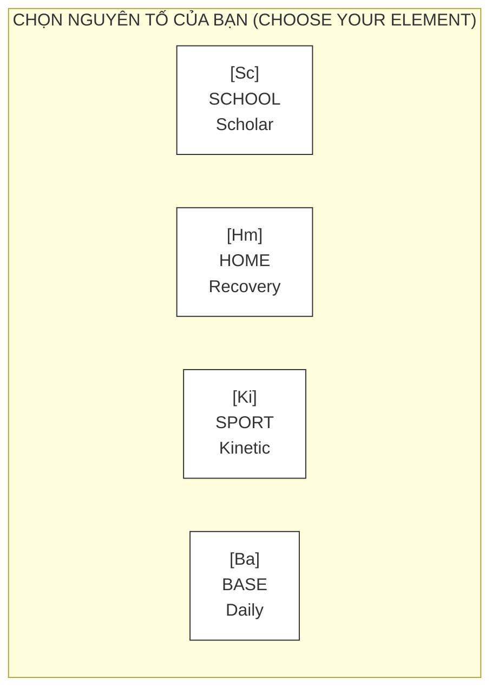
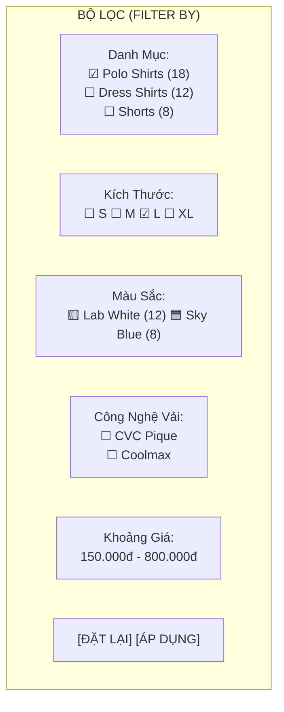
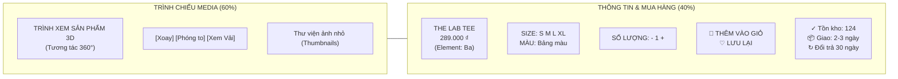
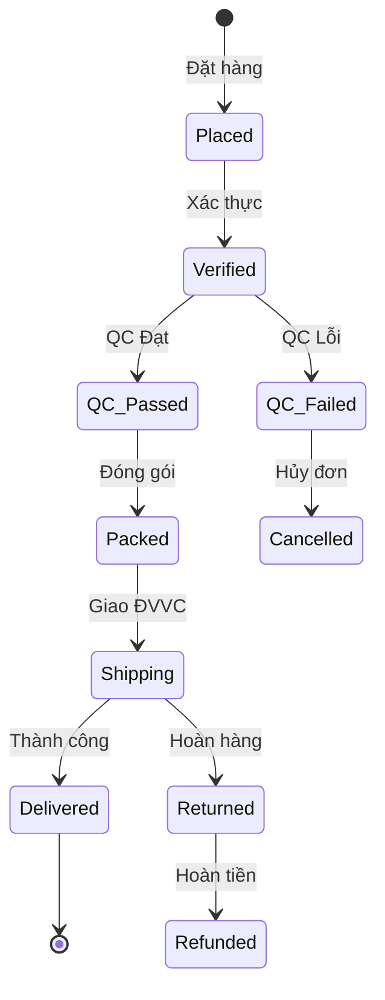
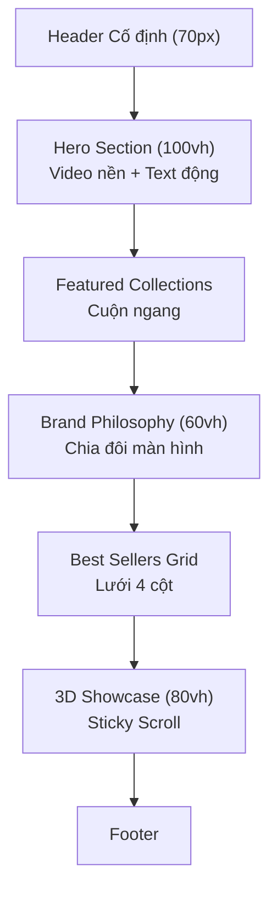
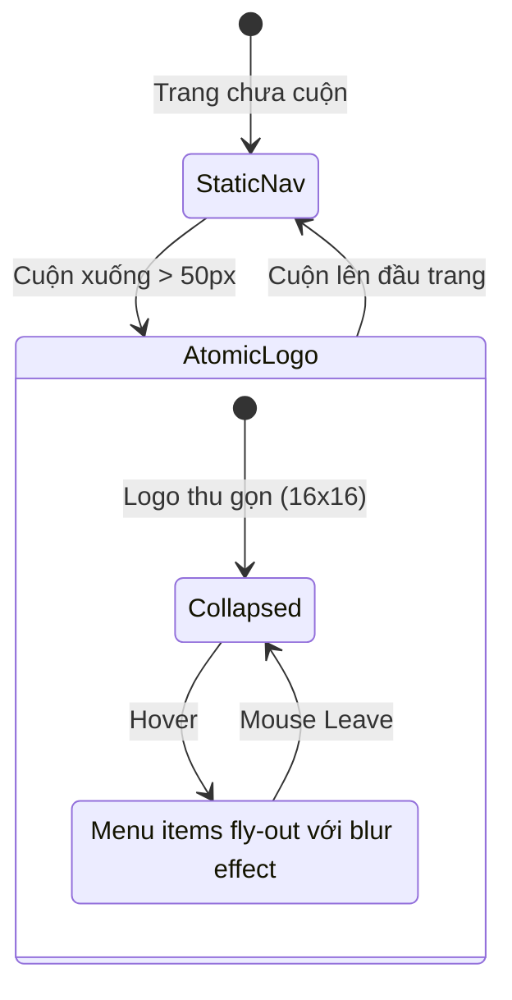

# 📑 TÀI LIỆU THIẾT KẾ KỸ THUẬT TOÀN DIỆN

## 🌐 NỀN TẢNG THƯƠNG MẠI ĐIỆN TỬ ELEMENTA

| Thông Tin      | Chi Tiết                   |
| :------------- | :------------------------- |
| **Phiên bản**  | 1.3 (Correction)           |
| **Ngày**       | 30 Tháng 1, 2026           |
| **Khách hàng** | ELEMENTA Fashion           |
| **Thực hiện**  | Đội ngũ Kiến trúc Kỹ thuật |

---

# 🎨 PHẦN 1: MÔ TẢ TRANG WEB & ĐỀ XUẤT

## 1. TỔNG QUAN DỰ ÁN

### 1.1. Giới Thiệu

**ELEMENTA E-Commerce Platform** là giải pháp website thương mại điện tử đẳng cấp quốc tế, được thiết kế riêng biệt cho thương hiệu thời trang **ELEMENTA** - thương hiệu tiên phong mô hình **M2C (Manufacturer to Consumer)** tại Việt Nam với triết lý _"The Science of Comfort"_ (Khoa học về sự thoải mái).

Website được xây dựng trên nền tảng công nghệ hiện đại, tập trung vào trải nghiệm người dùng vượt trội với các tính năng độc đáo:

- 🌌 **Trình xem 3D 360° tương tác**
- 📱 **Mobile-First** (Ưu tiên di động)
- 🌙 **Dark Mode First** (Giao diện tối ưu tiên)
- 🔬 **Thông số kỹ thuật vật liệu** (Material Dashboard)

Phục vụ đối tượng khách hàng Gen Z, Gen Alpha và Gen Y trên toàn cầu.

### 1.2. Mục Tiêu Kinh Doanh

- 🚀 **Chuyển đổi số toàn diện:** Dẫn dắt khách hàng từ các sàn TMĐT (Shopee, Lazada, TikTok Shop) về website chính thức.
- 💰 **Tăng biên lợi nhuận:** Loại bỏ phí nền tảng 15-25% của các sàn TMĐT.
- 🎮 **Kiểm soát trải nghiệm:** Sở hữu 100% hành trình khách hàng và trải nghiệm thương hiệu.
- 🌍 **Mở rộng toàn cầu:** Hỗ trợ đa ngôn ngữ (Tiếng Việt, Tiếng Anh) và thanh toán quốc tế.
- 📈 **Tỷ lệ chuyển đổi mục tiêu:** 3.5-5% (cao hơn trung bình ngành 2.8%).

### 1.3. Điểm Khác Biệt Cốt Lõi

| Tính Năng             | Sàn TMĐT Thông Thường   | ELEMENTA Platform                                                                   |
| :-------------------- | :---------------------- | :---------------------------------------------------------------------------------- |
| **Hiển thị sản phẩm** | Ảnh 2D tĩnh 4-6 tấm     | 🧊 **Trình xem 3D tương tác 360°** với khả năng zoom cận cảnh chi tiết sợi vải      |
| **Trải nghiệm**       | Giao diện mẫu chuẩn hóa | 🎨 **UX tùy chỉnh** theo Ngôn ngữ Thiết kế Công nghiệp (Industrial Design Language) |
| **Mua sắm ban đêm**   | Giao diện sáng chói mắt | 🌙 **Tối ưu Dark Mode** với màu Hổ phách (Amber `#FFB300`) dễ chịu cho mắt          |
| **Thông tin**         | Mô tả văn bản đơn giản  | 📊 **Bảng thông số kỹ thuật (Dashboard)** theo chuẩn Khoa học Vật liệu              |
| **Tin cậy**           | Đánh giá từ người dùng  | 🛡️ **Chứng nhận QC + Minh bạch dữ liệu vải**                                        |

---

## 2. THIẾT KẾ GIAO DIỆN & TRẢI NGHIỆM NGƯỜI DÙNG

### 2.1. Hệ Thống Ngôn Ngữ Thiết Kế (Design Language System)

Toàn bộ website tuân thủ hệ thống nhận diện thương hiệu "The Industrial Standard" với ngôn ngữ thiết kế **Swiss-Tech Minimalism** (Tối giản kiểu Thụy Sĩ kết hợp Công nghệ).

#### 2.1.1. Bảng Màu Chiến Lược

**Mô tả kỹ thuật màu sắc:**

- **MÀU CHỦ ĐẠO (PRIMARY):**
  - 🟡 **Industrial Amber (Vàng hổ phách):** `#FFB300` - Màu chủ đạo nhận diện.
  - ⚫ **Carbon Black (Đen than):** `#111111` - Dùng cho văn bản & điểm nhấn.
  - ⚪ **Concrete White (Trắng bê tông):** `#F4F4F4` - Nền chính, giảm chói mắt.

- **MÀU PHỤ (SECONDARY - DARK MODE):**
  - 🌑 **Deep Charcoal:** `#1A1A1A` - Màu nền chính.
  - 🔲 **Slate Gray:** `#2D2D2D` - Bề mặt thẻ (cards).
  - 🔵 **Hyperlink Blue:** `#0000FF` - Các phần tử tương tác, màu đặc trưng.

#### 2.1.2. Hệ Thống Typography

**Mô tả kỹ thuật font chữ:**

- **TIÊU ĐỀ (HEADINGS):** Sử dụng font **DIN Next LT Pro** (Heavy/Black).
  - H1: 48px (Desktop) / 64px (Mobile).
  - H2: 36px / 48px.
  - H3: 24px / 32px.
- **VĂN BẢN NỘI DUNG (BODY TEXT):** Sử dụng font **Space Mono** (Regular/Bold).
  - Body: 16px, chiều cao dòng (line-height) 1.6.
  - Caption: 14px.
  - Label: 12px (Viết hoa toàn bộ, tracking +0.5).
- **THÔNG SỐ KỸ THUẬT:** Sử dụng font **Courier New** (Monospace).
  - Kích thước 14px (Dữ liệu vải, số đo).

#### 2.1.3. Hệ Thống Lưới (Grid) & Khoảng Cách (Spacing)

- **Desktop:** Lưới 12 cột, độ rộng tối đa (max-width) 1440px.
- **Tablet:** Lưới 8 cột, độ rộng tối đa 1024px.
- **Mobile:** Lưới 4 cột, độ rộng tối đa 375px.
- **Tỷ lệ khoảng cách:** Đơn vị cơ sở 4px (4, 8, 16, 24, 32, 48, 64, 96px).

### 2.2. Trang Chủ (Homepage)

#### 2.2.1. Bố Cục & Luồng Điều Hướng

**Phần Hero Section:**

- Video/Hình ảnh hero toàn màn hình với hiệu ứng chuyển động thị sai (parallax).
- Slogan **"FROM LAB TO LIFE"** sử dụng typography lớn.
- Nút kêu gọi hành động (CTA) chính: **"EXPLORE ELEMENTS"** màu Amber.
- Hoạt ảnh chỉ báo cuộn (dạng biểu tượng cốc thí nghiệm).

**Module Điều Hướng Nguyên Tố (Element Navigation):**



_Mô tả module:_

- Mỗi "Ô Nguyên Tố" là một ô vuông tương tác.
- Bao gồm: Icon nguyên tố (ký hiệu hóa học [Sc], [Hm], [Ki], [Ba]).
- **Hiệu ứng Hover:** Lật thẻ 3D hiển thị các sản phẩm chính.
- **Click:** Điều hướng đến trang danh mục tương ứng.

**Lưới Sản Phẩm Nổi Bật (Featured Products Grid):**

- Bố cục Masonry không đều (tạo nhịp điệu thị giác).
- Mỗi thẻ sản phẩm có trạng thái hover nghiêng 3D (3D tilt effect).
- Nút xem nhanh (Quick-view) hiển thị modal trình xem 3D.

**Phần Bằng Chứng Xã Hội (Social Proof):**

- Huy hiệu "Engineered in Vietnam".
- Dashboard minh bạch sản xuất thời gian thực (số lượng đơn đang xử lý, tỷ lệ đạt QC).
- Thư viện ảnh khách hàng (UGC - User Generated Content).

**Bản Tin & Chân Trang (Newsletter + Footer):**

- Thu thập Email với thông điệp "Join the Lab Report".
- Footer với các liên kết nhanh, mạng xã hội, huy hiệu thanh toán.

#### 2.2.2. Đặc Điểm Tương Tác

| Phần tử              | Tương tác          | Hiệu ứng                                      |
| :------------------- | :----------------- | :-------------------------------------------- |
| **Thanh Điều Hướng** | Cuộn trang         | Chuyển từ trong suốt sang nền đặc             |
| **Thẻ Sản Phẩm**     | Di chuột (Hover)   | Hiệu ứng nghiêng 3D + Nút xem nhanh hiện dần  |
| **Ô Nguyên Tố**      | Nhấp chuột (Click) | Chuyển trang với hoạt ảnh phản ứng hóa học    |
| **Hero Section**     | Cuộn trang         | Cuộn thị sai (Parallax) với các lớp chiều sâu |

### 2.3. Trang Danh Mục Sản Phẩm (Product Listing Page - PLP)

#### 2.3.1. Bố Cục & Thành Phần

**Phần Header:**
Hiển thị tên bộ sưu tập (ví dụ: `[Sc] SCHOLAR COLLECTION`), slogan mô tả ("Sự tập trung cho học đường") và thanh công cụ chứa số lượng sản phẩm, sắp xếp.

**Bảng Bộ Lọc (Sidebar Filter):**



**Lưới Sản Phẩm:**

- **Desktop:** Lưới 3 cột responsive.
- **Tablet:** 2 cột.
- **Mobile:** 1 cột (dạng thẻ).

**Thiết Kế Thẻ Sản Phẩm:**

- Hiển thị ảnh 3D, hover để xoay 360 độ xem trước.
- Tên sản phẩm, giá tiền, huy hiệu nguyên tố ([Sc]).
- Nút Xem nhanh và Thêm vào giỏ hàng.

#### 2.3.2. Lọc & Sắp Xếp Thông Minh

- **Lọc thời gian thực:** Không tải lại trang (AJAX).
- **Huy hiệu đếm:** Sticky badge hiển thị số sản phẩm phù hợp.
- **Lịch sử lọc:** Lưu vào tham số URL (để chia sẻ link).
- **Gợi ý thông minh:** "Không có kết quả? Thử Bộ sưu tập [Ba] Base".

### 2.4. Trang Chi Tiết Sản Phẩm (Product Detail Page - PDP)

Trang quan trọng nhất quyết định tỷ lệ chuyển đổi, thiết kế theo chuẩn thương mại điện tử xa xỉ nhưng tối ưu cho người Việt Nam.

#### 2.4.1. Bố Cục Desktop (Tỷ lệ 60/40)



#### 2.4.2. Trình Xem Sản Phẩm 3D - Tính Năng Đột Phá

**Triển Khai Kỹ Thuật:**

- **Framework:** Three.js + React Three Fiber (R3F).
- **Định dạng Model:** GLB/GLTF (tối ưu hóa, <2MB mỗi model).
- **Ánh sáng:** PBR (Physically Based Rendering) với đèn ambient + directional.
- **Điều khiển:** OrbitControls cho xoay, zoom, pan.

**Tương Tác Người Dùng:**

- **Kéo để Xoay:** 360° ngang, 180° dọc.
- **Nhúm/Cuộn để Zoom:** 0.5x đến 3x.
- **Nhấp đúp:** Đặt lại vị trí camera.
- **Chuyển đổi Vật liệu:** Toggle giữa "Chế độ Sản phẩm" và "Chế độ Vải" (Zoom cực đại vào kết cấu sợi vải - hiệu ứng macro lens).
- **Tích hợp chọn màu:** Thay đổi vật liệu thời gian thực khi chọn màu.

**Chiến Lược Dự Phòng (Fallback cho thiết bị cấu hình thấp):**

- Phát hiện khả năng GPU qua WebGL detection.
- Nếu thiết bị yếu: Fallback về **ảnh 2D chất lượng cao** với CSS 3D transform.
- Nâng cấp lũy tiến: Tải model 3D sau khi trang đã render xong.

#### 2.4.3. Các Tab Thông Tin Sản Phẩm

1.  **Tab 1: THÔNG SỐ KỸ THUẬT (TECH SPECS - Mặc định):**
    - **Khoa học Vật liệu:** Vải (100% Cotton Compact 2-Way), Trọng lượng (260 GSM), Kiểu dệt (Plain weave/Tổ ong), Mã màu (Pantone 11-0601 TCX).
    - **Cấu trúc:** Mật độ đường may (14 SPI), Cổ áo (Interlining cứng 3.0cm), Gấu áo (Xẻ tà 4cm chặn bọ).
    - **Chứng nhận:** Oeko-Tex Standard 100, ISO 9001:2015 Manufacturing, Xem báo cáo Lab (PDF).

2.  **Tab 2: HƯỚNG DẪN SIZE (FIT GUIDE):**
    - Bảng size tương tác với số đo người mẫu.
    - Máy tính "Find My Size" (nhập chiều cao, cân nặng -> gợi ý size).
    - So sánh với các hãng phổ biến.

3.  **Tab 3: HƯỚNG DẪN BẢO QUẢN (CARE):**
    - Icon giặt ủi chuẩn ISO 3758.
    - Video hướng dẫn "Cách chăm sóc áo Lab Tee".
    - Thông tin bảo hành đường may trọn đời.

4.  **Tab 4: ĐÁNH GIÁ (REVIEWS):**
    - Xếp hạng sao + số lượng đánh giá.
    - Lọc theo: Đã mua hàng, Có ảnh/video.
    - Tóm tắt đánh giá bằng AI (phân tích cảm xúc).

#### 2.4.4. Tín Hiệu Tin Cậy & Sự Khẩn Cấp

- **Vị trí nổi bật:**
  - ✓ **Miễn phí vận chuyển** cho đơn >500.000 ₫.
  - ⚡ **Flash Deal:** Đồng hồ đếm ngược nếu có khuyến mãi.
  - 👥 **Social Proof:** "18 người đang xem sản phẩm này".
  - 📦 **Trạng thái kho:** "Chỉ còn 5 sản phẩm size L" (nếu <10).
  - 🏅 **Huy hiệu Best Seller** cho top 20% sản phẩm bán chạy.

### 2.5. Giỏ Hàng & Thanh Toán (Cart & Checkout)

#### 2.5.1. Giỏ Hàng Mini (Slide-in Panel)

Khi click icon giỏ hàng ở header, panel trượt ra từ bên phải hiển thị danh sách sản phẩm, tổng tiền tạm tính, thanh tiến trình "Mua thêm 13.000₫ để được Freeship", và gợi ý sản phẩm mua kèm.

#### 2.5.2. Luồng Thanh Toán (Checkout)

Thiết kế tối ưu trên 1 trang (Single-Page Optimized). Mục tiêu: Thời gian thanh toán < 3 phút.

**Bố cục (Desktop):**

- **Cột Trái:**
  1.  **Thông tin liên hệ:** Email, tuỳ chọn nhận tin cập nhật.
  2.  **Vận chuyển:** Tên, SĐT, Địa chỉ (Tỉnh/TP).
  3.  **Phương thức vận chuyển:** Tiêu chuẩn (2-4 ngày) hoặc Hỏa tốc (1-2 ngày).
  4.  **Thanh toán:** COD, Chuyển khoản ngân hàng, Momo/ZaloPay, Thẻ tín dụng.
- **Cột Phải:** Tóm tắt đơn hàng, mã giảm giá, tổng tiền.

**Tối ưu Mobile:**

- Chuyển sang dạng wizard nhiều bước (4 bước).
- Thanh tiến trình ở trên cùng.
- Nút CTA dính (sticky) ở dưới cùng.
- Nút thanh toán nhanh Apple Pay / Google Pay.

**Yếu tố tin cậy:** Huy hiệu bảo mật SSL, Nhắc nhở chính sách đổi trả, Chat hỗ trợ.

---

## 3. HỆ THỐNG QUẢN TRỊ TOÀN DIỆN (ELEMENTA OMNICHANNEL CMS)

Bản cập nhật CMS v2.0 - Tích hợp các tính năng quản lý chuyên sâu tương đương nền tảng Haravan Enterprise/Shopify Plus để tối ưu hóa vận hành mô hình M2C.

### 3.1. Tổng Quan Kiến Trúc Quản Trị

Hệ thống được thiết kế theo mô hình **Headless Commerce**, tách biệt Front-end (Storefront) và Back-end (Core Engine), giúp mở rộng không giới hạn.

**Core Modules:**

1.  **Operation Hub**: Xử lý đơn hàng, kho vận, sản phẩm.
2.  **Omnichannel Connect**: Đồng bộ đa kênh (Website, Shopee, TikTok Shop, POS).
3.  **Growth Engine**: Marketing, Loyalty, CRM.
4.  **Data Intelligence**: Báo cáo phân tích chuyên sâu.

### 3.2. Dashboard Điều Hành (Control Center)

**Giao diện "Single-Pane-of-Glass":**

- **Real-time Metrics:**
  - Doanh thu theo giờ thực (Live Revenue).
  - Visitor đang online (Live Traffic).
  - Sự cố cần xử lý (Failed Payments, QC Rejects).
- **To-Do List Thông Minh:**
  - 🔔 "5 đơn hàng mới từ TikTok Shop chưa xác nhận"
  - 📦 "3 sản phẩm Base Tee size L dưới định mức tồn kho"
  - 💬 "2 tin nhắn mới trên Facebook chưa trả lời"

### 3.3. Quản Lý Sản Phẩm & Tồn Kho (Advanced PIM)

#### 3.3.1. Quản Lý Sản Phẩm Đa Chiều

- **Biến thể (Variants) không giới hạn:** Quản lý theo ma trận Size / Màu / Chất liệu / Year Collection.
- **Thuộc tính tùy chỉnh (Metafields):**
  - _Vải:_ GSM, Thành phần (cotton %), độ co giãn.
  - _Dệt:_ Kiểu dệt (Pique, Jersey...), Mật độ.
  - _Sản xuất:_ Nhà máy gia công, Mã lô sản xuất.
- **Digital Assets:** Quản lý tập trung hình ảnh 4K, video runway, và **file 3D (.glb)** cho từng biến thể.

#### 3.3.2. Quản Lý Tồn Kho Đa Kho (Multi-Warehouse)

Tính năng quan trọng cho mô hình M2C (Kho nhà máy -> Kho Fulfillment -> Cửa hàng):

- **Định vị kho:** Cấu hình nhiều kho (Kho Tổng HCM, Kho Hà Nội, Kho Đà Nẵng).
- **Điều chuyển kho:** Tạo phiếu chuyển hàng (Stock Transfer) giữa các kho.
- **Kiểm kê:** Quy trình kiểm kho (Stocktake) bằng quét mã barcode/QR.
- **Dự báo nhập hàng:** Gợi ý số lượng cần sản xuất thêm dựa trên tốc độ bán (Sales velocity).

### 3.4. Quản Lý Bán Hàng Đa Kênh (Omnichannel)

Đồng bộ tập trung về một nơi duy nhất - ELEMENTA Admin.

- **Sync Shopee / Lazada / TikTok Shop:**
  - Đồng bộ tồn kho 2 chiều (bán ở Web, giảm tồn ở Shopee).
  - Đồng bộ đơn hàng về Admin để xử lý tập trung.
  - Đẩy sản phẩm từ Admin lên sàn (Bulk Push).
- **Social Commerce:**
  - Tích hợp Facebook/Instagram Shop.
  - Tự động ẩn comment chứa số điện thoại.
  - Chốt đơn tự động qua livestream comment.
- **POS (Tại Pop-up Store):**
  - Giao diện bán hàng tại quầy cho nhân viên (iPad app).
  - Quét mã vạch thanh toán, in hóa đơn.

### 3.5. Xử Lý Đơn Hàng & Vận Chuyển

#### 3.5.1. Quy Trình Fulfillment Tự Động

**Workflow:** `New` -> `Verified` -> `QC Passed` -> `Packed` -> `Shipping` -> `Delivered`.



- **Tự động gán vận chuyển:** Tự động chọn ĐVVC (GHTK/GHN/Ahamove) có phí rẻ nhất hoặc tốc độ nhanh nhất theo khu vực khách hàng.
- **In vận đơn hàng loạt:** Chỉ 1 click in 100 đơn (khổ A6/A7).
- **Quản lý Hoàn/Hủy (RMA):** Quy trình xử lý đổi trả, hoàn tiền, nhập kho hàng hoàn, đánh giá lý do hoàn (Lỗi SP / Khách đổi ý).

#### 3.5.2. Cổng Thanh Toán (Payment Gateway)

- **Tích hợp sâu:** Momo, ZaloPay (QR Code động), Thẻ ATM/Visa/Master (qua OnePay/VNPAY).
- **Buy Now Pay Later:** Tích hợp Fundiin/Kredivo.
- **Đối soát COD:** Báo cáo đối soát tiền thu hộ từ ĐVVC tự động.

### 3.6. Marketing & Tăng Trưởng (Growth Tools)

Bộ công cụ mạnh mẽ để tăng AOV (Giá trị đơn hàng trung bình) và LTV (Vòng đời khách).

#### 3.6.1. Khuyến Mãi Nâng Cao (Promotions)

- **Mã giảm giá linh hoạt:**
  - Theo % hoặc số tiền cố định.
  - Áp dụng cho: Sản phẩm cụ thể, Bộ sưu tập, Khách hàng VIP.
  - Điều kiện: Tổng đơn tối thiểu, Giới hạn lượt dùng.
- **Chương trình tự động (Automatic Discount):**
  - "Mua X tặng Y" (Buy 1 Get 1).
  - "Combo giá sốc" (Mua Áo + Quần giảm 15%).
  - Tiered Discount (Mua 2 giảm 5%, Mua 3 giảm 10%).
  - Flash Sale (Đếm ngược, giới hạn số lượng bán).

#### 3.6.2. Loyalty & CRM

- **Elementa Rewards (Điểm thưởng):** Tích 1 điểm cho mỗi 100k mua hàng. Đổi điểm lấy Voucher hoặc Quà tặng độc quyền.
- **Hạng thành viên (Membership Tiers):**
  - _Base Member:_ Mặc định.
  - _Scholar:_ Chi tiêu > 2tr. (Freeship trọn đời).
  - _Kinetic:_ Chi tiêu > 10tr. (Early access BST mới).
- **Phân nhóm khách hàng (Segmentation):** Lọc danh sách "Khách chưa quay lại trong 30 ngày", "Khách chi tiêu cao (Whales)" để chạy Facebook Ads (Lookalike Audience).

#### 3.6.3. Affiliate & Referral

- Tạo link tiếp thị liên kết cho KOL/KOC.
- Tính hoa hồng tự động theo doanh số.
- Dashboard cho Partner xem hiệu quả.

### 3.7. Báo Cáo & Tài Chính (Business Intelligence)

Hệ thống báo cáo chuẩn CFO:

- **Báo cáo Lãi/Lỗ (P&L):** Doanh thu - (Giá vốn + Phí ship + Phí sàn + Marketing) = Lợi nhuận ròng.
- **Báo cáo Bán hàng:** Theo kênh bán, theo nhân viên, theo khu vực địa lý.
- **Báo cáo Tồn kho:** Tốc độ quay vòng vốn, Hàng bán chậm (Dead stock), Giá trị tồn kho thời gian thực.
- **Google Analytics 4 & Pixel:** Tích hợp sâu sự kiện E-commerce (ViewContent, AddToCart, Purchase, InitiateCheckout).

### 3.8. Cấu Hình Hệ Thống & Phân Quyền

- **Tên miền & DNS:** Quản lý SSL miễn phí.
- **Nhân viên & Phân quyền:**
  - _Super Admin:_ Toàn quyền.
  - _Kho:_ Chỉ xem đơn hàng & tồn kho.
  - _Marketing:_ Chỉ xem báo cáo & tạo promotion.
  - _CSKH:_ Chỉ xem đơn hàng & chat với khách.
- **Nhật ký hoạt động (Audit Logo):** Ghi lại mọi thao tác của nhân viên để tra soát (Ai đã sửa giá? Ai đã hủy đơn?).

## 4. TRIẾT LÝ THIẾT KẾ & CẢM HỨNG

### 4.1. Nguyên Tắc Thiết Kế Cốt Lõi

Lấy cảm hứng từ các thương hiệu thời trang cao cấp hàng đầu (Gucci, Dior, Miu Miu), nền tảng ELEMENTA tuân thủ **6 nguyên tắc UX của thương mại điện tử xa xỉ**:

1.  **🌫️ KHOẢNG TRẮNG LÀ SỰ SANG TRỌNG (Whitespace as Luxury):**
    - Tỷ lệ khoảng trắng 40-60%.
    - Padding lớn (80-120px) giữa các section.
    - Sản phẩm có không gian để "thở", không chen chúc.

2.  **🔠 PHÂN CẤP THỊ GIÁC QUA TYPOGRAPHY:**
    - Tiêu đề lớn, đậm (64-96px).
    - Thang tỷ lệ chữ rõ ràng (Tỷ lệ 1.25).
    - Giới hạn độ đậm font (Chỉ dùng Regular, Medium, Bold).

3.  **📸 ƯU TIÊN HÌNH ẢNH CHẤT LƯỢNG CAO:**
    - Ảnh Hero tràn viền màn hình (Full-bleed).
    - Chiều rộng tối thiểu 2000px cho ảnh sản phẩm.
    - Sử dụng nhiếp ảnh chuyên nghiệp, không dùng ảnh stock.

4.  **🧭 ĐIỀU HƯỚNG TỐI GIẢN:**
    - Header cố định với ít hơn 5 mục menu.
    - Sử dụng Hamburger menu cho các điều hướng phụ.
    - Không sử dụng Mega menu lộn xộn.

5.  **✨ HOẠT ẢNH TINH TẾ (Subtle Animations):**
    - Hiệu ứng xuất hiện khi cuộn (Fade-in, slide-up).
    - Chuyển trang mượt mà (300-500ms).
    - Các vi tương tác (Micro-interactions) khi hover/click.

6.  **🌑 DARK MODE FIRST (Ưu tiên giao diện tối):**
    - Tối ưu hóa màu đen thuần (`#000000`) cho màn hình OLED.
    - Giảm mỏi mắt khi mua sắm ban đêm.
    - Nút chuyển đổi chế độ dễ thấy nhưng không gây phiền.

### 4.2. Đặc Tả Design Tokens (Mở rộng)

Thay vì mã nguồn thô, dưới đây là bảng đặc tả các biến số thiết kế (Design Tokens) để đội ngũ Dev thiết lập:

**Bảng Màu (Color Palette):**

| Token (Mã Màu)   | Giá Trị (Dark Mode)      | Giá Trị (Light Mode)  | Mô tả Sử dụng                   |
| :--------------- | :----------------------- | :-------------------- | :------------------------------ |
| `background`     | `#0A0A0A` (Đen thuần)    | `#FAFAFA` (Off-white) | Màu nền chính (Main Background) |
| `surface`        | `#1A1A1A` (Than chì)     | `#FFFFFF` (Trắng)     | Bề mặt thẻ, container           |
| `primary`        | `#D4AF37` (Vàng Amber)   | `#D4AF37`             | Màu chủ đạo, Nút CTA            |
| `text-primary`   | `#FFFFFF` (Trắng)        | `#1A1A1A` (Đen)       | Văn bản chính                   |
| `text-secondary` | `#A0A0A0` (Xám 62%)      | `#666666`             | Văn bản phụ, mô tả              |
| `border`         | `rgba(255,255,255,0.08)` | `rgba(0,0,0,0.08)`    | Đường viền trang trí            |

### 4.3. Hệ Thống Typography

Sử dụng thang tỷ lệ **Perfect Fourth (1.25)** để đảm bảo tính hài hòa.

| Role        | Token Size    | Kích thước (px) | Font Family          | Ứng dụng                  |
| :---------- | :------------ | :-------------- | :------------------- | :------------------------ |
| **Display** | `--text-6xl`  | 76.3px          | Univers Next / Inter | Tiêu đề Hero Banner       |
| H1          | `--text-5xl`  | 61.0px          | Univers Next / Inter | Tiêu đề Trang             |
| H2          | `--text-4xl`  | 48.8px          | Univers Next / Inter | Tiêu đề Section           |
| H3          | `--text-2xl`  | 31.3px          | Univers Next / Inter | Tên sản phẩm trong Card   |
| Body        | `--text-base` | 16.0px          | Univers Next / Inter | Văn bản nội dung          |
| Caption     | `--text-sm`   | 12.8px          | Univers Next / Inter | Chú thích ảnh             |
| **Code**    | `--font-mono` | 14.0px          | JetBrains Mono       | Mã SKU, Thông số kỹ thuật |

---

## 5. THÔNG SỐ KỸ THUẬT CHI TIẾT TỪNG TRANG (PAGE-BY-PAGE SPECS)

### 5.1. TRANG CHỦ (HOMEPAGE) - Chi Tiết Kỹ Thuật

**Cấu trúc Layout (Sơ đồ khối):**



#### 5.1.1. Đặc Tả Kỹ Thuật Hero Section

Thay vì mã nguồn, dưới đây là bảng đặc tả các thành phần DOM và hành vi tương tác:

| Thành phần (Component) | Loại thẻ / Class                   | Mô tả Kỹ thuật               | Styling & Hoạt ảnh                                                                                          |
| :--------------------- | :--------------------------------- | :--------------------------- | :---------------------------------------------------------------------------------------------------------- |
| **Container**          | `section.hero-section`             | Bao bọc toàn màn hình.       | `height: 100vh`, `position: relative`.                                                                      |
| **Video Nền**          | `video` (trong `.hero-background`) | Video nền chất lượng cao.    | `autoplay`, `muted`, `loop`. `object-fit: cover`. Opacity 0.7.                                              |
| **Lớp Phủ (Overlay)**  | `div.hero-overlay`                 | Tăng độ tương phản cho text. | Gradient tuyến tính từ đen mờ (30%) đến đen đậm (70%).                                                      |
| **Tiêu đề Chính**      | `h1.hero-headline`                 | Slogan 2 dòng.               | Font 76px. Hoạt ảnh `slideUpFade`: Trượt từ dưới lên (TranslateY 100% -> 0%) với độ trễ 0.2s cho từng dòng. |
| **Nút CTA**            | `a.cta-primary`                    | Nút "Explore".               | Nền màu Primary (#D4AF37). Hover: Nâng nhẹ (`-2px`) và đổ bóng (`box-shadow`).                              |
| **Chỉ báo Cuộn**       | `.scroll-indicator`                | Icon mũi tên ở đáy           | Hoạt ảnh `bounce` (nảy lên xuống) vô hạn chu kỳ 2s.                                                         |

**Logic JavaScript Tương tác:**

1.  **On Load:** Video hiện dần (Fade-in 0.5s) -> Text trượt lên -> Nút CTA hiện ra.
2.  **On Scroll:** Hiệu ứng Parallax cho video nền (Tốc độ cuộn video = 0.5 x Tốc độ cuộn trang). Nội dung mờ dần khi cuộn.

#### 5.1.2. Đặc Tả Kỹ Thuật Phần Bộ Sưu Tập (Featured Collections)

**Cấu trúc:** Danh sách các thẻ (Card) xếp theo chiều ngang, hỗ trợ cử chỉ vuốt chạm trên mobile.

**Đặc tả UI Component (.collection-card):**

| Trạng thái           | Hành vi (Behavior)                                            | Hiệu ứng (Visual Effect)                                                                                                                          |
| :------------------- | :------------------------------------------------------------ | :------------------------------------------------------------------------------------------------------------------------------------------------ |
| **Mặc định**         | Hiển thị ảnh bìa, Tên bộ sưu tập và Ký hiệu nguyên tố ([Ba]). | Ảnh nền chất lượng cao. Text nằm đè lên ảnh ở phía dưới.                                                                                          |
| **Hover (Di chuột)** | Người dùng đưa chuột vào thẻ.                                 | 1. Ảnh nền Zoom nhẹ (1.05x - Ken Burns effect).<br/>2. Mô tả & Link "Explore" trượt từ dưới lên.<br/>3. Mũi tên điều hướng dịch chuyển sang phải. |
| **Scroll (Cuộn)**    | Cuộn ngang danh sách.                                         | `scroll-snap-type: x mandatory` (Tự động bắt dính thẻ vào giữa màn hình). Hiệu ứng Parallax nhẹ cho ảnh nền khi cuộn.                             |

#### 5.1.3. Đặc Tả Kỹ Thuật 3D Interactive Showcase

**Mô hình:** Scrollytelling (Kể chuyện qua thao tác cuộn).
**Chiều cao Section:** 400vh (Gấp 4 lần chiều cao màn hình thực tế) để tạo không gian cuộn.

**Bảng Ánh xạ Cuộn (Scroll Mapping Logic):**

| Tiến trình Cuộn (%) | Góc xoay Model 3D | Hành động UI (Trigger)                                            |
| :------------------ | :---------------- | :---------------------------------------------------------------- |
| **0% - 25%**        | 0° → 90°          | Hiển thị Model. Thanh tiến trình bắt đầu chạy.                    |
| **25% - 35%**       | 90° (Giữ yên)     | **Hiện thông tính năng 1:** "2-Way Stretch" (Co giãn 2 chiều).    |
| **35% - 50%**       | 90° → 180°        | Xoay sang mặt sau. Ẩn tính năng 1.                                |
| **50% - 60%**       | 180° (Giữ yên)    | **Hiện thông tính năng 2:** "Moisture-Wicking" (Thấm hút mồ hôi). |
| **60% - 75%**       | 180° → 270°       | Tiếp tục xoay. Ẩn tính năng 2.                                    |
| **75% - 85%**       | 270° (Giữ yên)    | **Hiện thông tính năng 3:** "UV Protection" (Chống tia UV).       |
| **85% - 100%**      | 270° → 360°       | Hoàn tất vòng xoay. Chuẩn bị sang section tiếp theo.              |

---

### 5.2. TRANG DANH MỤC SẢN PHẨM (PLP) - Chi Tiết Kỹ Thuật

**Cấu trúc Layout Lưới (Grid System):**

| Thiết bị                | Cấu trúc Sidebar             | Cấu trúc Lưới Sản phẩm  | Gap (Khoảng cách) |
| :---------------------- | :--------------------------- | :---------------------- | :---------------- |
| **Desktop** (≥1024px)   | Cố định bên trái (280px)     | 4 Cột                   | 32px              |
| **Tablet** (768-1023px) | Ngăn kéo (Drawer) ẩn/hiện    | 2 Cột                   | 24px              |
| **Mobile** (<768px)     | Bottom Sheet (Trượt từ dưới) | 1 Cột (Full-width Card) | 16px              |

**Đặc Tả Component Thẻ Sản Phẩm (.product-card):**

Thành phần quan trọng nhất trong việc hiển thị danh sách.

- **Tỷ lệ khung hình:** `3:4` (Chuẩn thời trang).
- **Cấu trúc DOM:**
  1.  **Container Ảnh (`image-link`):**
      - Chứa `primary-image` (Mặt trước) và `hover-image` (Mặt sau/Lifestyle).
      - Nút `quick-add`: Ẩn mặc định, trượt lên khi hover.
      - Badges: "New", "-20%".
      - Nút Yêu thích (Tim).
  2.  **Container Nội dung (`card-content`):**
      - Tag Nguyên tố: `[Ba]`.
      - Tên sản phẩm: Font H3, Link tới PDP.
      - Color Swatches: Các ô chọn màu nhỏ (+3 màu khác).
      - Giá: Giá hiện tại (Đậm) + Giá gốc (Gạch ngang).

**Tương tác & API:**

- **Quick Add (Thêm nhanh):**
  - _Trigger:_ Click nút "Quick Add" trên thẻ.
  - _Action:_ Mở Modal chọn Size.
  - _API:_ `POST /api/cart/add`.
  - _Feedback:_ Hiển thị Toast thông báo thành công, update số lượng trên Header Cart.
- **Infinite Scroll (Cuộn vô hạn):**
  - _Logic:_ Sử dụng `Intersection Observer` API.
  - _Trigger:_ Khi cuộn đến cách đáy trang 200px.
  - _Action:_ Fetch 20 sản phẩm tiếp theo (AJAX). Append vào lưới DOM.
  - _Loading:_ Hiển thị Spinner trong lúc tải.

---

### 5.3. TRANG CHI TIẾT SẢN PHẨM (PDP) - Chi Tiết Kỹ Thuật

**Cấu trúc Layout (Desktop Split View):**


#### 5.3.1. Đặc Tả Kỹ Thuật Trình Xem 3D (3D Viewer)

Tích hợp thư viện `Three.js` và `React-Three-Fiber`.

| Tính năng                    | Mô tả Kỹ thuật                           | API / Logic                                                                                      |
| :--------------------------- | :--------------------------------------- | :----------------------------------------------------------------------------------------------- |
| **Tải Model**                | Tải bất đồng bộ (Lazy load) file `.glb`. | `useGLTF('/models/tee-base-v1.glb')`. Hiển thị Skeleton loader khi đang tải.                     |
| **Orbit Controls**           | Cho phép xoay, zoom.                     | Giới hạn góc xoay dọc (Polat Angle) để tránh nhìn xuyên sàn. Zoom giới hạn 1x-3x.                |
| **Chuyển màu**               | Thay đổi màu sắc realtime.               | Truy cập Mesh Material -> Thay đổi thuộc tính `color` của PBR Material. Không tải lại model mới. |
| **Chế độ Vải (Fabric Mode)** | Zoom siêu cận cảnh bề mặt vải.           | Chuyển đổi Camera FOV (Field of View) từ 45 -> 15. Update Normal Map độ phân giải cao.           |

#### 5.3.2. Logic Các Tab Thông Tin

Sử dụng cấu trúc nội dung dạng Tab để tối ưu không gian hiển thị:

1.  **Thông số Kỹ thuật:** Hiển thị dữ liệu từ Database (GSM, Thành phần vải, Kiểu dệt).
2.  **Hướng dẫn Size (Fit Guide):** Tính năng "Find My Size":
    - _Input:_ Chiều cao (cm), Cân nặng (kg), Dáng người (Gầy/Vừa/Đậm).
    - _Algorithm:_ So sánh với bảng size chart -> Trả về gợi ý (Ví dụ: "75% người như bạn chọn Size L").
3.  **Hướng dẫn Bảo quản:** Icon vector SVG chuẩn ISO (Giặt tay, Không tẩy...).
4.  **Đánh giá (Reviews):** Tích hợp module đánh giá, cho phép upload ảnh feedback.

### 5.4. GIỎ HÀNG & THANH TOÁN (CART & CHECKOUT)

#### 5.4.1. Giỏ Hàng Mini (Slide-in Panel)

Khi click icon giỏ hàng ở header, panel trượt ra từ bên phải hiển thị danh sách sản phẩm, tổng tiền tạm tính, thanh tiến trình "Mua thêm 13.000₫ để được Freeship", và gợi ý sản phẩm mua kèm.

#### 5.4.2. Luồng Thanh Toán (Checkout Page)

Thiết kế tối ưu 1 trang (Single Page Checkout).

**Thông Số Form Nhập Liệu:**

| Nhóm thông tin  | Trường dữ liệu (Field)         | Validate (Kiểm tra)   | Ghi chú                            |
| :-------------- | :----------------------------- | :-------------------- | :--------------------------------- |
| **Liên hệ**     | Email, Số điện thoại           | Regex email, 10 số VN | Tự động điền nếu đã đăng nhập.     |
| **Vận chuyển**  | Tỉnh/TP, Quận/Huyện, Phường/Xã | API GHN/GHTK          | Dropdown phụ thuộc nhau (Cascade). |
| **Vận chuyển**  | Địa chỉ cụ thể                 | Required              |                                    |
| **Phương thức** | Radio Option (COD / CK / Thẻ)  | Required              | Mặc định: COD.                     |

---

## 6. LỘ TRÌNH TRIỂN KHAI & NGÂN SÁCH

Dự án được chia thành 3 giai đoạn (Phase) để đảm bảo chất lượng và tiến độ.

### 6.1. Bảng Lộ Trình (Roadmap)

| Giai đoạn                  | Thời gian     | Cột mốc (Milestone)                                                                                        | Ngân sách ước tính (VND)         |
| :------------------------- | :------------ | :--------------------------------------------------------------------------------------------------------- | :------------------------------- |
| **Phase 1: Foundation**    | Tuần 1 - 4    | 1. Thiết lập hạ tầng (Next.js, Supabase).<br/>2. Design System & UI Kit.<br/>3. Phát triển Homepage & PLP. | **80.000.000 - 100.000.000 ₫**    |
| **Phase 2: Core Platform** | Tuần 5 - 8    | 1. Phát triển PDP & 3D Viewer.<br/>2. Hệ thống Giỏ hàng & Thanh toán.<br/>3. Xây dựng CMS Admin Panel.     | **120.000.000 - 140.000.000 ₫**  |
| **Phase 3: Launch**        | Tuần 9 - 10   | 1. Kiểm thử (QC) & Sửa lỗi.<br/>2. Nhập liệu nội dung & Sản phẩm.<br/>3. Triển khai Production & SEO.      | **60.000.000 - 80.000.000 ₫**    |
| **TỔNG CỘNG**              | **2.5 Tháng** | **Hoàn thiện nền tảng M2C Commerce**                                                                       | **~240.000.000 - 320.000.000 ₫** |

### 6.2. Kết Luận

Tài liệu này xác định nền tảng kỹ thuật vững chắc cho ELEMENTA, kết hợp giữa:

1.  **🚀 Công nghệ Tiên phong:** 3D Visualization, Next.js 14, Headless CMS.
2.  **💎 Trải nghiệm Đẳng cấp:** UX tối giản, mượt mà, đậm chất thời trang công nghiệp.
3.  **⚙️ Vận hành Hiệu quả:** Quy trình quản lý đơn hàng tự động hóa cho mô hình M2C.

Đội ngũ kỹ thuật cam kết tuân thủ các tiêu chuẩn này để hiện thực hóa tầm nhìn "From Lab To Life" của ELEMENTA.

---

## 7. DEMO MVP - THAM CHIẾU TRIỂN KHAI

> **Lưu ý:** Phần này bổ sung thông tin từ Demo MVP (https://github.com/hts2008/ELEMENTA_DEMO_MVP) để đối chiếu với thiết kế gốc và ghi nhận các quyết định triển khai thực tế.

### 7.1. Tech Stack Demo MVP

| Thành phần    | TDD Đề xuất        | Demo MVP Triển khai                          | Ghi chú                             |
| :------------ | :----------------- | :------------------------------------------- | :---------------------------------- |
| **Framework** | Next.js 14         | **Vite + React 18.2**                        | Demo dùng Vite cho tốc độ dev nhanh |
| **Styling**   | TailwindCSS        | **Tailwind CDN**                             | Cấu hình inline trong `index.html`  |
| **3D Engine** | Three.js + R3F     | **Three.js 0.160 + @react-three/fiber 8.15** | ✓ Đúng theo TDD                     |
| **Routing**   | Next.js App Router | **react-router-dom 6.22** (HashRouter)       | SPA với hash routing                |
| **Charts**    | -                  | **Recharts 2.12**                            | Dùng cho Admin Dashboard            |
| **Icons**     | -                  | **Lucide React 0.344**                       | Bộ icon hiện đại                    |

### 7.2. Cấu Trúc Thư Mục Demo

```
ELEMENTA_DEMO_MVP/
├── index.html              # Entry point + Tailwind config
├── App.tsx                 # Router setup
├── constants.ts            # ELEMENTS data + MOCK_PRODUCTS
├── types.ts                # TypeScript interfaces
├── context/
│   └── store.tsx           # Global state (Dark mode, Cart)
├── components/
│   ├── Layout.tsx          # Header, Footer, Cart Drawer, Login Modal
│   ├── Product3DViewer.tsx # Three.js 3D Viewer với Wireframe mode
│   ├── ProductCard.tsx     # Product card với scan effect
│   ├── Element3DCard.tsx   # Element card với 3D background
│   └── ScrollReveal.tsx    # Scroll animation component
└── pages/
    ├── Home.tsx            # Homepage với Hero, Elements, Philosophy
    ├── Shop.tsx            # PLP với Filter sidebar
    ├── ProductDetail.tsx   # PDP với 3D Viewer
    └── AdminDashboard.tsx  # Dashboard với Charts
```

### 7.3. Bổ Sung Bảng Màu Element

Mỗi Element trong hệ thống có màu riêng để phân biệt:

| Element     | Code   | Tên                  | Màu Tailwind     | Màu Hex   | Mô tả Ngắn                 |
| :---------- | :----- | :------------------- | :--------------- | :-------- | :------------------------- |
| **Base**    | `[Ba]` | Cốt Lõi Hàng Ngày    | `text-gray-400`  | `#9CA3AF` | Nền tảng thiết yếu         |
| **Scholar** | `[Sc]` | Học Thuật / Công Sở  | `text-blue-400`  | `#60A5FA` | Sự tập trung tối đa        |
| **Kinetic** | `[Ki]` | Vận Động / Hiệu Suất | `text-red-400`   | `#F87171` | Khí động học               |
| **Home**    | `[Hm]` | Phục Hồi / Tại Gia   | `text-green-400` | `#4ADE80` | Trạng thái không trọng lực |

### 7.4. Cập Nhật Typography System

**Theo triển khai thực tế trong Demo:**

```css
/* Font Stack (Demo MVP) */
--font-sans: "Inter", sans-serif; /* Body text */
--font-mono: "JetBrains Mono", monospace; /* Technical specs, labels */
--font-display: "Space Mono", monospace; /* Headings, titles */
```

| Role            | Font Family    | Ứng dụng                          |
| :-------------- | :------------- | :-------------------------------- |
| **Sans (Body)** | Inter          | Mô tả sản phẩm, nội dung đoạn văn |
| **Mono**        | JetBrains Mono | Nhãn, thông số kỹ thuật, giá tiền |
| **Display**     | Space Mono     | Tiêu đề trang, tên sản phẩm, CTA  |

### 7.5. Reactive Navigation (Nâng cao hơn TDD)

Demo triển khai hệ thống Navigation phản ứng độc đáo:



**Đặc điểm:**

- **Static Nav**: Full header với logo, menu items, icons (Dark/Light, User, Cart)
- **Atomic Logo**: Khi cuộn, thu gọn thành logo tròn dạng "nguyên tử" với 2 orbit animation
- **Hover Expand**: Menu items "fly-out" từ trái sang phải với stagger delay và blur effect
- **Floating Cart**: Nút giỏ hàng nổi ở góc phải khi nav collapsed

### 7.6. System Marquee (Tính năng mới)

Demo bổ sung thanh thông báo chạy ngang ở trên cùng:

`[AMBER BACKGROUND #FFB300]`
`"System v2.1 Online /// Free Shipping > 500K /// 30-Day Returns /// Engineered in Vietnam"`

- **Vị trí**: Fixed top, trên header
- **Hành vi**: Ẩn đi khi cuộn xuống (`-translate-y-full`)
- **Animation**: `marquee 20s linear infinite`

### 7.7. Nội Dung Homepage Chi Tiết (Từ Code Analysis)

**Dựa trên file `Home.tsx`:**

**Section 1: Hero Section**

> **[Badge]** System v2.1 Ready
>
> THE SCIENCE OF COMFORT.
> _"Tại ELEMENTA, quần áo là lớp da thứ hai. Phục vụ cuộc sống của bạn, chứ không bắt bạn phục vụ nó."_
>
> `[KHÁM PHÁ NGAY →]`

**Section 2: Element Navigation (Bảng Hệ Thống)**

- **[Ba] Base:** `Wind` Icon
- **[Sc] Scholar:** `Microscope` Icon
- **[Ki] Kinetic:** `Zap` Icon
- **[Hm] Home:** `HomeIcon`

**Section 3: Featured Products (Laboratory Issue)**
_"Mẫu vật mới nhất"_

**Section 4: Philosophy (Triết Lý)**
_3 Trụ cột chính:_

1.  **NGUYÊN BẢN** - Vải tự dệt (In-house Fabric).
2.  **TINH GIẢN** - Loại bỏ chi tiết thừa.
3.  **MINH BẠCH** - Giá gốc tận xưởng.

### 7.8. 3D Viewer Modes

Demo triển khai 2 chế độ xem:

| Mode          | Mô tả                                               | Controls                        |
| :------------ | :-------------------------------------------------- | :------------------------------ |
| **Render**    | Model 3D với PBR materials, auto-rotate (0.5 speed) | OrbitControls, Reset View       |
| **Wireframe** | Hiển thị cấu trúc wireframe với glow effect amber   | Holographic rings, scan overlay |

### 7.9. Scroll Animation System (ScrollReveal)

Demo sử dụng component `ScrollReveal` với nhiều chế độ:

- `direction`: 'up', 'down', 'left', 'right'
- `mode`: 'scroll' (theo vị trí cuộn) hoặc 'trigger' (khi xuất hiện).

### 7.10. Element 3D Card - Dissolve Shader Effect

Demo triển khai hiệu ứng **dissolve/burn** độc đáo cho Element Cards sử dụng custom GLSL shader:

- Sử dụng **Simplex Noise** để tạo pattern ngẫu nhiên.
- Khi hover: ảnh nền "tan chảy" hiện ra từ lớp concrete màu xám.
- Viền cháy màu Amber (`#FFB300`) tạo hiệu ứng "burning edge".

### 7.11. Các Trang Demo Hiện Có

| Route          | Component           | Trạng thái                                           |
| :------------- | :------------------ | :--------------------------------------------------- |
| `/`            | `HomePage`          | ✅ Hoàn thiện (Hero, Elements, Featured, Philosophy) |
| `/shop`        | `ShopPage`          | ✅ Hoàn thiện (Filter, Sort, Grid)                   |
| `/product/:id` | `ProductDetailPage` | ✅ Hoàn thiện (3D Viewer, Specs, Size, Color)        |
| `/admin`       | `AdminDashboard`    | ⚠️ Demo (Dashboard + Charts, không có CRUD)          |
| `/about`       | Placeholder         | ⭕ Chưa triển khai                                   |

---

## 8. PHỤ LỤC

### 8.1. Màu Sắc Sản Phẩm Mặc Định

| Tên màu               | Mã Hex    |
| :-------------------- | :-------- |
| Lab White (Trắng Ngà) | `#F4F4F4` |
| Carbon Ink (Đen Than) | `#111111` |
| Hyperlink Blue (Xanh) | `#0000FF` |

### 8.2. Kích Thước Sản Phẩm

Sizes tiêu chuẩn: **S**, **M**, **L**, **XL**

---

**HẾT TÀI LIỆU**

| Phiên bản | Ngày       | Nội dung                                   |
| :-------- | :--------- | :----------------------------------------- |
| 1.0       | 29/01/2026 | Tạo tài liệu gốc                           |
| 1.1       | 30/01/2026 | Bổ sung Section 7, 8 từ phân tích Demo MVP |
